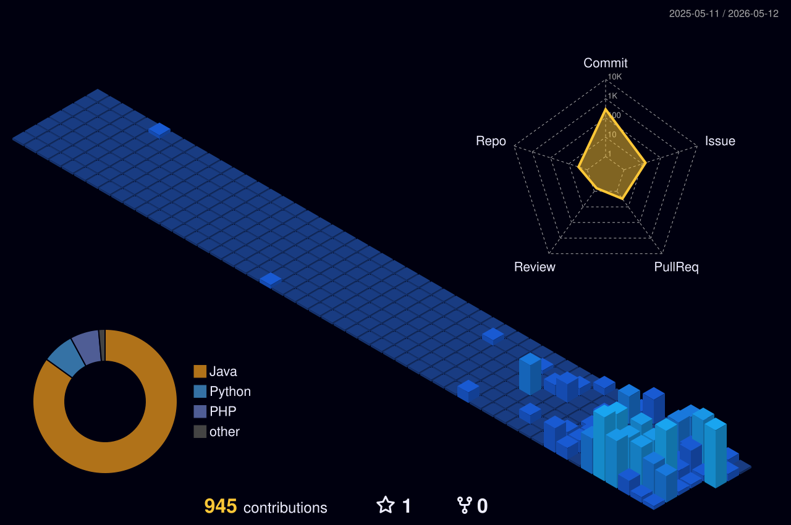

---

## English

> Hey, I'm **vyrriox** — amateur dev and manager of the modpack **Arcadia: Echoes of Power**.
> I tinker with modded Minecraft, build systems, and break things until they work.

### Featured Project

> **[Team Arcadia](https://github.com/Team-Arcadia)** — Home of *Arcadia: Echoes of Power*, a NeoForge 1.21.1 modpack where magic meets machinery. Custom cross-mod progression, curated mods, and an evolving ruleset.

<table align="center">
<tr>
<td valign="top" width="50%">
<h4><a href="https://github.com/Team-Arcadia/Arcadia-RsPolymorph">📦 Arcadia-RsPolymorph</a></h4>
NeoForge mod — Polymorph compatibility for Refined Storage 2 (recipe selection in Crafting & Pattern Grid).  

</td>
<td valign="top" width="50%">
<h4><a href="https://github.com/Team-Arcadia/Arcadia-Admin-Pannel">🛠 Arcadia-Admin-Pannel</a></h4>
Minecraft admin panel mod for Arcadia server management.  

</td>
</tr>
<tr>
<td valign="top" width="50%">
<h4><a href="https://github.com/Team-Arcadia/Arcadia-LootBox">🎁 Arcadia-LootBox</a></h4>
Minecraft mod adding a loot box system for the Arcadia server.  

</td>
<td valign="top" width="50%">
<h4><a href="https://github.com/Team-Arcadia/Arcadia-Spawn-Dimension">🌍 Arcadia-Spawn-Dimension</a></h4>
Minecraft mod adding a custom spawn dimension for the Arcadia server.  

</td>
</tr>
</table>

### Connect

---

## Français

> Salut, je suis **vyrriox** — développeur amateur et gérant du modpack **Arcadia: Echoes of Power**.
> Je bricole du Minecraft moddé, je construis des systèmes, et je casse tout jusqu'à ce que ça fonctionne.

### Projet phare

> **[Team Arcadia](https://github.com/Team-Arcadia)** — La maison d'*Arcadia: Echoes of Power*, un modpack NeoForge 1.21.1 où la magie rencontre la machinerie. Progression cross-mod sur mesure, mods sélectionnés, et un univers en évolution constante.

<table align="center">
<tr>
<td valign="top" width="50%">
<h4><a href="https://github.com/Team-Arcadia/Arcadia-RsPolymorph">📦 Arcadia-RsPolymorph</a></h4>
Mod NeoForge — compatibilité Polymorph pour Refined Storage 2 (sélection de recette dans Crafting & Pattern Grid).  

</td>
<td valign="top" width="50%">
<h4><a href="https://github.com/Team-Arcadia/Arcadia-Admin-Pannel">🛠 Arcadia-Admin-Pannel</a></h4>
Mod Minecraft — panneau d'administration pour la gestion du serveur Arcadia.  

</td>
</tr>
<tr>
<td valign="top" width="50%">
<h4><a href="https://github.com/Team-Arcadia/Arcadia-LootBox">🎁 Arcadia-LootBox</a></h4>
Mod Minecraft ajoutant un système de loot boxes pour le serveur Arcadia.  

</td>
<td valign="top" width="50%">
<h4><a href="https://github.com/Team-Arcadia/Arcadia-Spawn-Dimension">🌍 Arcadia-Spawn-Dimension</a></h4>
Mod Minecraft ajoutant une dimension de spawn personnalisée pour le serveur Arcadia.  

</td>
</tr>
</table>

### Me contacter

---

## ⚔ Live Servers / Serveurs en ligne

Status updated in real-time via mcstatus.io · Status mis à jour en temps réel via mcstatus.io

🇫🇷 **France**

🇺🇸 **USA**

---

## 💬 Discord — Arcadia: Echoes of Power

 

---

## 📥 CurseForge — vyrriox

Live download stats across all my CurseForge projects — auto-updated daily / Statistiques live de téléchargements, mises à jour quotidiennement · <a href="https://www.curseforge.com/members/vyrriox/projects">profile</a>

<!-- CURSEFORGE_START -->
 

<!-- CURSEFORGE_END -->

---

## 📊 Stats / Statistiques

**Top Languages** &nbsp;·&nbsp; weighted across all repos in <a href="https://github.com/Team-Arcadia">Team Arcadia</a> + personal repos / pondéré sur tous les repos Team Arcadia et perso

 

 

3D contribution graph — auto-generated daily / Graphique 3D des contributions, généré quotidiennement

 

  

---

### ⛏ Quote / Citation

<!-- QUOTE_START -->
> ⛏ *"Wake up. The universe said I love you."*
> — **Julian Gough**, Minecraft End Poem

> ⛏ *"Réveille-toi. L'univers a dit je t'aime."*
> — **Julian Gough**, Poème de fin de Minecraft
<!-- QUOTE_END -->

