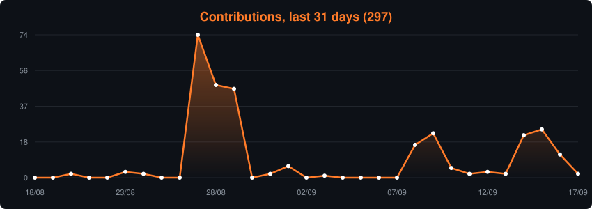

<a href="#about">About</a> · <a href="#fivem-resources">FiveM</a> · <a href="#arcadia-echoes-of-power">Arcadia</a> · <a href="#stats">Stats</a> · <a href="#live-servers">Servers</a>

## About

**EN** · Hey, I'm **vyrriox**, amateur dev and manager of the modpack **Arcadia: Echoes of Power**.
I tinker with modded Minecraft, write open-source FiveM resources, and break things until they work.

- Building a full roleplay stack for FiveM: framework, phone, HUD, parking, sport
- Running a 490+ mod NeoForge modpack with public servers in France and the USA
- Writing server-side mods, Azuriom plugins and the tooling around them

**FR** · Salut, je suis **vyrriox**, développeur amateur et gérant du modpack **Arcadia: Echoes of Power**.
Je bricole du Minecraft moddé, j'écris des ressources FiveM open source, et je casse tout jusqu'à ce que ça fonctionne.

 

  

---

## FiveM Resources

Open-source GTA V roleplay scripts for qb-core, qbx_core, ESX and ox_core <i>Scripts roleplay GTA V open source, compatibles avec tous les frameworks</i>

---

## Arcadia: Echoes of Power

A NeoForge 1.21.1 modpack where magic meets machinery: 490+ mods, 3000+ quests, custom cross-mod progression <i>Un modpack NeoForge 1.21.1 où la magie rencontre la machinerie : 490+ mods, 3000+ quêtes, progression cross-mod sur mesure</i>

  

CurseForge downloads, refreshed every 6 hours / Téléchargements CurseForge, actualisés toutes les 6 heures

<!-- CURSEFORGE_START -->
 

<!-- CURSEFORGE_END -->

---

## Stats

<!-- LANGUAGES_START -->

<!-- LANGUAGES_END -->

Languages across public personal and Team Arcadia repos / Langages sur tous les repos publics

  

<picture>
  <source media="(prefers-color-scheme: dark)" srcset="https://raw.githubusercontent.com/laforetbrut/laforetbrut/output/snake-dark.svg" />
  <source media="(prefers-color-scheme: light)" srcset="https://raw.githubusercontent.com/laforetbrut/laforetbrut/output/snake.svg" />
  
</picture>

<table width="100%">
<tr>
<td valign="top" width="50%">

#### Recent activity / Activité récente

<!-- RECENT_ACTIVITY_START -->
| Date | Activity |
|:--|:--|
| 2026-09-24 | Pushed to [Team-Arcadia/Arcadia-V2-Client](https://github.com/Team-Arcadia/Arcadia-V2-Client) |
| 2026-09-24 | Issue on [tr7zw/EntityCulling](https://github.com/tr7zw/EntityCulling) |
| 2026-09-24 | Issue on [george8188625/Create-Diesel-Generators](https://github.com/george8188625/Create-Diesel-Generators) |
| 2026-09-23 | Released [laforetbrut/v-phone-fivem](https://github.com/laforetbrut/v-phone-fivem) `v1.7.12` |
| 2026-09-23 | Pushed to [laforetbrut/v-phone-fivem](https://github.com/laforetbrut/v-phone-fivem) |
| 2026-09-23 | Released [laforetbrut/v-park-fivem](https://github.com/laforetbrut/v-park-fivem) `v1.2.12` |
<!-- RECENT_ACTIVITY_END -->

</td>
<td valign="top" width="50%">

#### Latest releases / Dernières versions

<!-- RELEASES_START -->
| Date | Repository | Version |
|:--|:--|:--|
| 2026-09-23 | [laforetbrut/v-phone-fivem](https://github.com/laforetbrut/v-phone-fivem) | [`v1.7.12`](https://github.com/laforetbrut/v-phone-fivem/releases/tag/v1.7.12) |
| 2026-09-23 | [laforetbrut/v-park-fivem](https://github.com/laforetbrut/v-park-fivem) | [`v1.2.12`](https://github.com/laforetbrut/v-park-fivem/releases/tag/v1.2.12) |
| 2026-08-07 | [laforetbrut/v-sport-fivem](https://github.com/laforetbrut/v-sport-fivem) | [`v1.0.3`](https://github.com/laforetbrut/v-sport-fivem/releases/tag/v1.0.3) |
| 2026-08-05 | [Team-Arcadia/arcadia-patch-create](https://github.com/Team-Arcadia/arcadia-patch-create) | [`1.4.3`](https://github.com/Team-Arcadia/arcadia-patch-create/releases/tag/1.4.3) |
| 2026-08-04 | [laforetbrut/v-hud-fivem](https://github.com/laforetbrut/v-hud-fivem) | [`v1.0.1`](https://github.com/laforetbrut/v-hud-fivem/releases/tag/v1.0.1) |
<!-- RELEASES_END -->

</td>
</tr>
</table>

---

## Live Servers

France

USA

Event & community

---

<!-- QUOTE_START -->
> *"The world is only as limited as your imagination."*
> **Mojang**, Minecraft tagline

> *"Le monde n'est limité que par ton imagination."*
> **Mojang**, slogan Minecraft
<!-- QUOTE_END -->

<!-- UPDATED_START -->
Last updated / Dernière mise à jour : 2026-09-25 05:00 UTC
<!-- UPDATED_END -->

